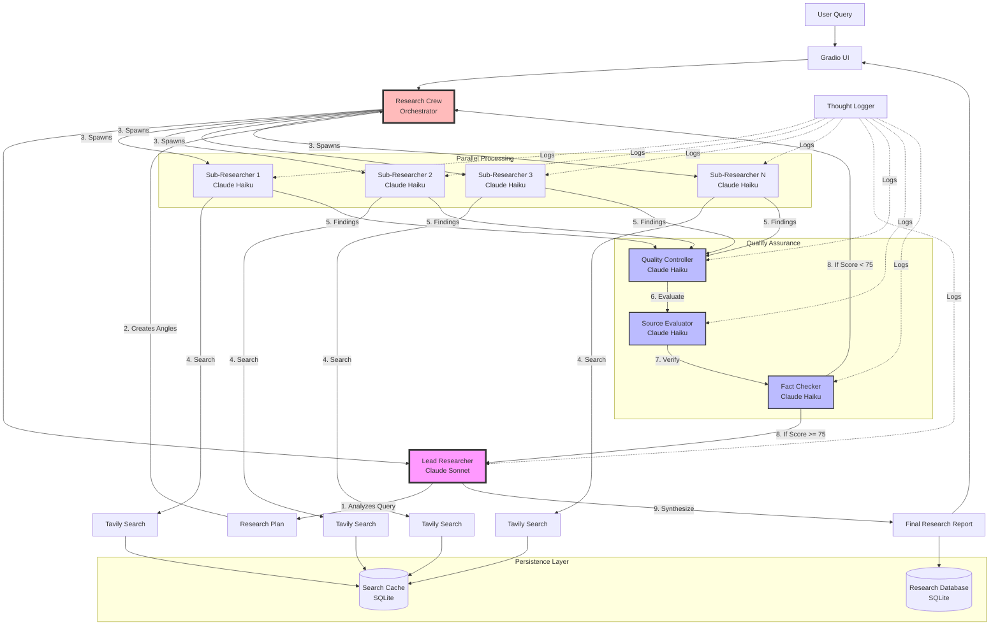
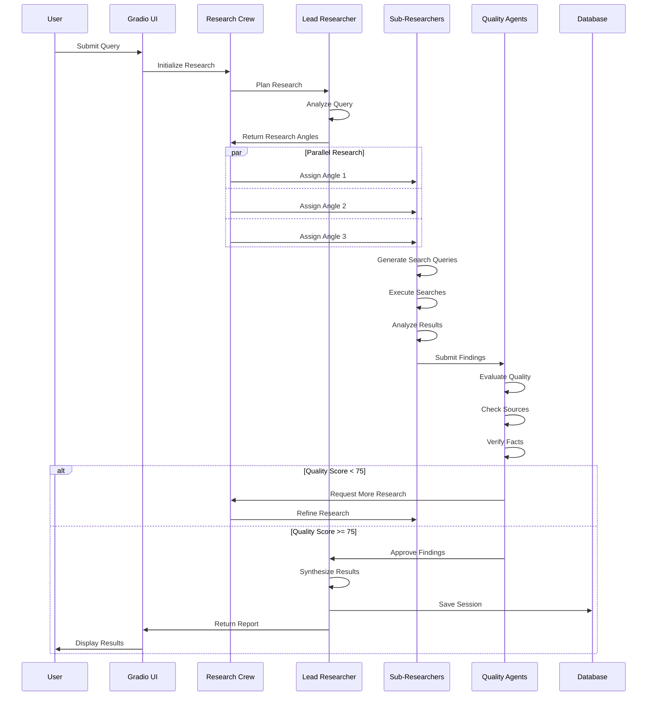
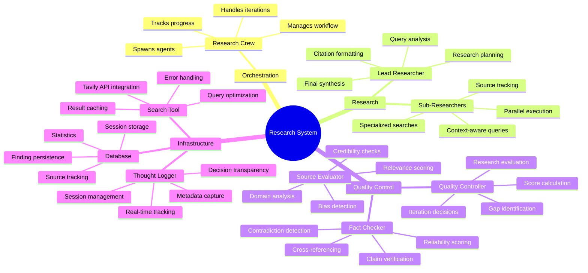
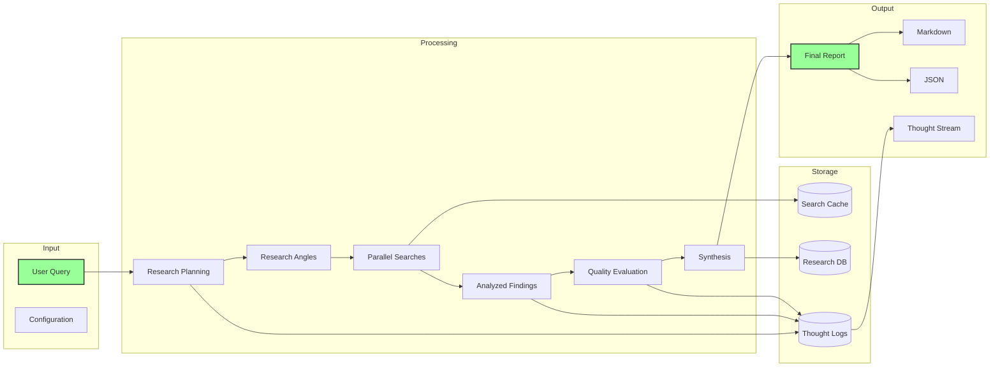

# Multi-Agent Research System Architecture

## Agent Interaction Diagram

## Agent Workflow Sequence

## Agent Roles and Responsibilities

## Data Flow Diagram

## Cost and Performance Characteristics

| Agent Type | Model | Cost/1M tokens | Typical Usage | Purpose |
|------------|-------|----------------|---------------|---------|
| Lead Researcher | Claude Sonnet | $3/$15 | 2 calls per query | High-quality planning & synthesis |
| Sub-Researchers | Claude Haiku | $0.80/$4 | 3-5 calls each | Cost-effective parallel research |
| Quality Agents | Claude Haiku | $0.80/$4 | 1-2 calls each | Efficient quality control |

## Key Design Decisions

1. **Hierarchical Structure**: Lead researcher coordinates to ensure coherent output
2. **Parallel Processing**: Multiple sub-researchers work simultaneously for speed
3. **Quality Gates**: Automated quality control prevents low-quality results
4. **Iterative Refinement**: Can loop up to 3 times for better results
5. **Cost Optimization**: Expensive models only where needed
6. **Transparency**: All decisions logged for debugging and analysis
7. **Persistence**: All research saved for future reference

## Typical Research Flow Example

For a query like "What are the best practices for implementing RAG systems?":

1. **Lead Researcher** identifies 5 research angles:
   - RAG architecture patterns
   - Vector database selection
   - Chunking strategies
   - Retrieval optimization
   - Evaluation metrics

2. **5 Sub-Researchers** work in parallel, each:
   - Generating 3 search queries
   - Analyzing 15-20 search results
   - Extracting key findings

3. **Quality Controller** evaluates:
   - Coverage completeness
   - Source diversity
   - Information accuracy

4. **Source Evaluator** checks:
   - Academic papers vs blogs
   - Publication dates
   - Author credibility

5. **Fact Checker** verifies:
   - Technical claims
   - Performance metrics
   - Best practice recommendations

6. **Lead Researcher** synthesizes:
   - Executive summary
   - Detailed findings
   - Actionable recommendations
   - Cited sources

Total time: ~30-60 seconds
Total cost: ~$0.10-0.20